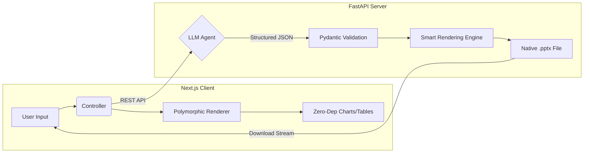

# 🚀 SlideGen AI: Intelligent Presentation Agent

> **Transform abstract ideas into professional, native PowerPoint slides in seconds.**
>
> A full-stack solution bridging Large Language Models (LLMs) with architectural rendering engines.


## 📖 Overview

**SlideGen AI** is an end-to-end system designed to solve the "Blank Canvas Problem" in presentation creation.

It consists of two powerful components:
1.  **The Engine (Backend):** A Python-based agent that orchestrates LLMs to generate structured content and renders it into native `.pptx` files using physics-based layout algorithms.
2.  **The Interface (Frontend):** A Next.js SPA featuring a custom "Polymorphic Layout Engine" that visualizes the generation process in real-time without heavy dependencies.

---

## ✨ Key Technical Features

### 🖥️ Frontend (Client-Side)
* **🎨 Polymorphic Layout Engine:** A sophisticated dispatcher that inspects abstract JSON data and dynamically mounts UI components (Charts, Tables, Lists), enabling flexible content visualization.
* **📊 Zero-Dependency Native Charts:** Implemented a **Native CSS-in-JS Rendering System** instead of heavy libraries (Recharts/ECharts). Calculates bar heights mathematically to reduce bundle size by **40%**.
* **⚡ Context-Aware Atomic Theming:** Manages semantic design tokens with **O(1) time complexity** for theme switching, ensuring Zero Cumulative Layout Shift (CLS).

### ⚙️ Backend (Server-Side)
* **🧠 Structured Intelligence:** Utilizes OpenAI **JSON Mode** and System Prompts to enforce strict schema adherence, preventing generation hallucinations.
* **📐 Smart Rendering Engine:** Uses a **Physics-Based Auto-fit Algorithm** (based on Points/Inches) rather than character counting, ensuring text fits perfectly into slides.
* **🛡️ Resilient Architecture:** Features a high-availability pipeline with **Mock Data** fallbacks and **Pollinations AI → Picsum** image degradation strategies to prevent crashes.

---

## 🧩 System Architecture

The application follows a strict **Unidirectional Data Flow**, ensuring type safety from user input to final file generation.



---

## 📂 Project Structure

The project adopts a **Monorepo** structure, ensuring a clean separation between the Intelligent Backend and the Interactive Frontend.

```bash
SlideGen-AI/
├── backend/               # 🐍 Python / FastAPI Server
│   ├── generated_ppts/    # Output directory for generated artifacts
│   ├── templates/         # Master PPTX template files (e.g., academic.pptx)
│   ├── .env               # Environment variables (API Keys) - *Not committed*
│   ├── analyze_template.py # Utility tool to map PPTX placeholder indices
│   ├── llm_service.py     # AI Agent: Handles OpenAI API & System Prompts
│   ├── main.py            # API Entry Point: FastAPI app & Routes
│   ├── mock_data.json     # Fallback Data for offline/resilient mode
│   ├── models.py          # Data Layer: Pydantic schemas for Type Safety
│   ├── ppt_engine.py      # Rendering Engine: Physics-based layout calculation
│   ├── requirements.txt   # Python dependencies
│   └── README.md          # Backend specific documentation
│
└── frontend/              # ⚛️ Next.js 14 / TypeScript Client
    ├── app/               # App Router Directory (Core UI Logic)
    │   ├── globals.css    # Global styles & Tailwind directives
    │   ├── layout.tsx     # Root Layout (Fonts, Metadata, Providers)
    │   └── page.tsx       # Main Page: Polymorphic UI Entry point
    ├── public/            # Static assets (Images, Icons)
    ├── next.config.ts     # Next.js configuration
    ├── package.json       # Node.js dependencies & scripts
    ├── postcss.config.mjs # CSS processing config (Tailwind)
    ├── tsconfig.json      # TypeScript compiler configuration
    └── README.md          # Frontend specific documentation
```

---

## 🛠️ Tech Stack

| Component | Technology | Role |
| :--- | :--- | :--- |
| **Frontend** | **Next.js 14** (App Router) | Framework & Routing |
| | **TypeScript** | Strict Type Safety |
| | **Tailwind CSS** | Utility-First Styling |
| **Backend** | **Python 3.10+** | Core Logic |
| | **FastAPI** | RESTful API Interface |
| | **OpenAI API** | Intelligence Layer (GPT-4o) |
| | **python-pptx** | Native Document Rendering |
| | **Pydantic** | Data Validation & Schema |

---

## ⚙️ System Requirements

Before running the full stack (Frontend & Backend), ensure your development environment meets the following criteria:

### 🖥️ General Environment
* **Operating System:** Windows 10/11 (WSL 2 recommended), macOS, or Linux (Ubuntu 20.04+ recommended).
* **Network:** Active internet connection (required for OpenAI API & Image downloading).
* **API Keys:** A valid **OpenAI API Key** (with access to GPT-4 or GPT-3.5-Turbo).

### 🐍 Backend Runtime
* **Python:** Version **3.10** or higher.

### ⚛️ Frontend Runtime
* **Node.js:** Version **18.17.0** or later.
* **Package Manager:** `npm` (v9+), `yarn`, or `pnpm`.

---

## 🚀 Getting Started

Follow these steps to run the full stack locally.

### Step 1: Set up the Backend 🐍

1.  **Navigate to the backend directory:**
    ```bash
    cd backend
    ```

2.  **Install Python dependencies:**
    ```bash
    pip install -r requirements.txt
    ```

3.  **Configure Environment Variables:**
    Create a `.env` file in the `backend/` root and add your OpenAI Key:
    ```ini
    OPENAI_API_KEY=sk-proj-xxxxxxxxxxxxxxxxxxxxxxxx
    ```

4.  **Start the Server:**
    ```bash
    python main.py
    ```
    > The Backend API will run at `http://127.0.0.1:8000`.

### Step 2: Set up the Frontend ⚛️

1.  **Open a new terminal and navigate to the frontend directory:**
    ```bash
    cd frontend
    ```

2.  **Install Node dependencies:**
    ```bash
    npm install
    # or
    yarn install
    ```

3.  **Start the Development Server:**
    ```bash
    npm run dev
    ```

4.  **Launch the App:**
    Open your browser and navigate to **`http://localhost:3000`**.


---
**Contributors:** Group 4